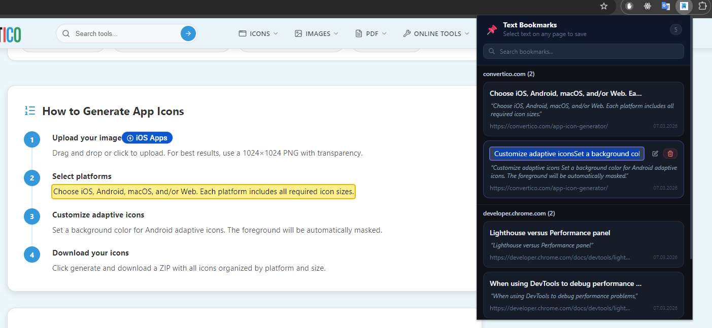
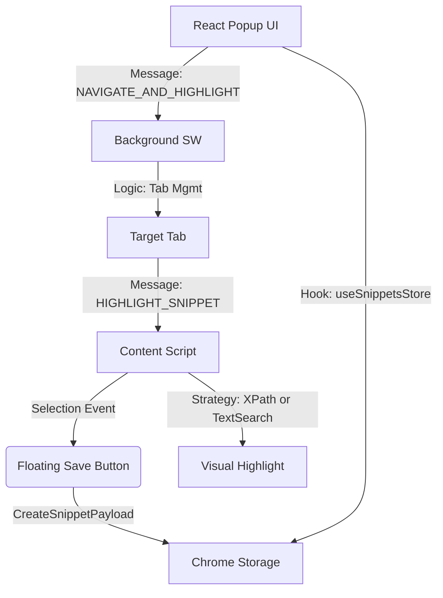

# Text Bookmarks



Chrome Extension (MV3) that allows users to save text selections as bookmarks, with precise scroll-to-position and highlight restoration.

## 📺 How it Works

See the extension in action: saving a selection, navigating back, and automatic highlighting.

[**Watch Demonstration Video (MP4)**]
_(Tip: To show a video player directly on GitHub, drag and drop the video file into the README editor on the GitHub website.)_

https://github.com/user-attachments/assets/17e4d0af-5c29-4fda-a608-1ebb0be5934c


## 🏗 Architecture & Data Flow



### 1. Layers

- **Shared Layer:** Framework-agnostic. Contains types, constants, and utilities for XPath and Chrome Storage.
- **Background (Service Worker):** Handles cross-tab logic. It manages tab navigation, waits for page load, and dispatches the highlight command.
- **Content Script:** The bridge to the DOM. Manages the selection UI (floating button) and executes the visual highlight restoration.
- **Popup (React 18 + Zustand):** A modern UI for managing snippets, grouped by domain with real-time sync via `storage.onChanged`.

---

## 🔍 Selection Cases: Technical Deep Dive

When a user selects text, the extension handles these complex scenarios:

| Case  | Scenario                                            | Technical Solution                                                                                                                       |
| :---- | :-------------------------------------------------- | :--------------------------------------------------------------------------------------------------------------------------------------- |
| **1** | **Mixed HTML Tags** (e.g., `Text <b>Bold</b> Text`) | `Range API` identifies the deepest text nodes for start/end. `extractContents()` preserves nested tags during highlight.                 |
| **2** | **Simple Text Node**                                | Captures XPath to the text node and character offsets. Most stable case.                                                                 |
| **3** | **Multiple Nested Tags**                            | XPath uses `text()[n]` notation to target specific segments between sibling tags, ensuring precision even in heavy nesting.              |
| **4** | **Distributed Content**                             | If a selection spans multiple paragraphs/divs, `getBoundingClientRect()` of the range helps position the Save button correctly.          |
| **5** | **Partial Tag Selection**                           | DOM-based Range API never captures "broken" HTML. It extracts a valid sub-tree, ensuring the UI doesn't break when wrapping in `<mark>`. |

---

## 🛡️ Resilience & Fallback Mechanisms

1. **Strategy A: XPath Restoration**
   The extension first tries to find the exact DOM nodes using generated XPaths (`/html/body/div[2]/p/text()[1]`). This is the most precise method.

2. **Strategy B: TreeWalker Text Search** (Fallback)
   If the DOM structure changed (e.g., a div was added above), the XPath will fail. The extension then uses a `TreeWalker` to search for the first 50 characters of the snippet text globally.

3. **Strategy C: Scroll Position Fallback**
   If both A and B fail (text was deleted or heavily changed), the extension still scrolls to the original `scrollY` coordinate captured at save time.

4. **Double Injection Guard**
   Uses a `<meta id="__tbm-guard__">` in the document head to prevent the content script from running multiple times on the same page during SPA navigation or manual re-injection.

---

## 🚀 Development

```bash
yarn install
yarn format     # Prettier formatting
yarn lint       # ESLint check
yarn type-check # TypeScript validation
yarn build      # Production build to /dist
yarn test       # Run tests
```
